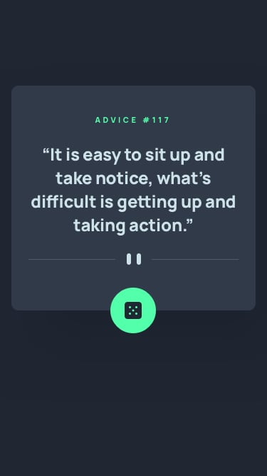

<h2>Random Advice Generator</h2>

This is my solution to <strong>Random Advice Generator</strong> challenge by Frontendmentor.io. which is based on simple HTML-CSS and javascript. This uses Advice Slip JSON API to provide you a quick tip.

<h3>Live Link</h3>
<a href="https://sonakshirawat.github.io/Advice-Generator/">Click here</a>

<h3>Build Using</h3>
<ul>
  <li>HTML5 Markup language</li>
  <li>CSS3 Custom Properties</li>
     <li>Vanilla javascript</li>
</ul>

<h3>Screenshots</h3>

